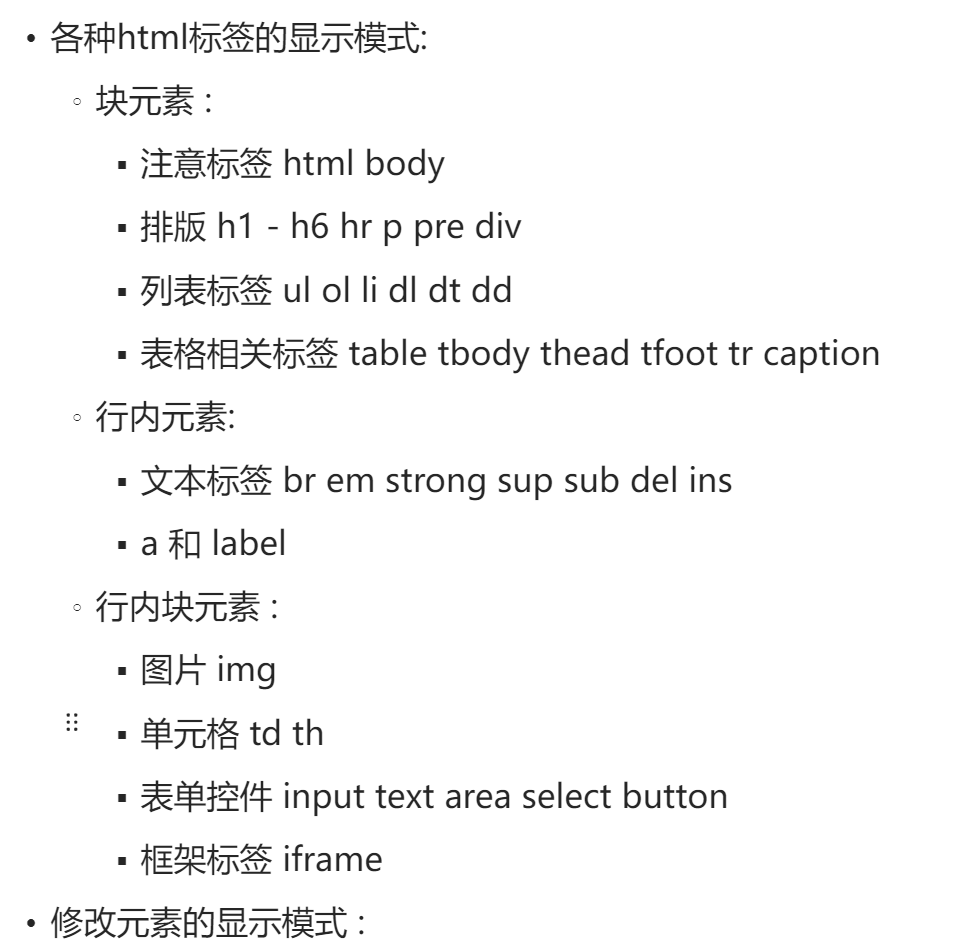

# 尚品汇项目总结
- 此项目完全使用原生的 html 和 css 制作
## 注意事项如下:
### 如何进行中央对齐
- 首先如果是一个块元素,方法如下:
  - 可以在块元素的属性中设置 margin: 0 auto , 但是前提就是这一个块元素原来有宽度
  - 其次可以首先把块元素利用 display: inline-block,变成块元素,之后父元素中设置 text-align: center
- 如果是一个行内元素或者块元素
  - 可以在父元素中把这一个行内元素当成文字对待,就是设置 text-align: center
  - 另外如果需要设置行内元素和字体进行基线对齐,就是如果需要垂直对齐的话,就需要直接设置 veritcal-align: middle(当然,如果这一个元素的高度足够,就可以设置为 top 或者 middle 此时移动的就是文字),如果想要绝对的中央对齐,就可以使用 font-size: 0; 消除基线的影响
### 注意标签的种类

### 注意精灵图的应用
- 精灵图的出现就是防止客户端向服务器端多次请求图片造成服务器端压力过载,所以使用精灵图
- 精灵图的使用方式 : 利用相对定位结合绝对定位的方式,每一次就只是露出原来的一小块部分,但是注意各种子元素中间相对定位置的递归关系
### 注意语义化
- 比如使用标签就是看中了它的语义而不是默认效果(实际上 reset.css中就是消除了标签的默认效果),比如表示并列的信息可以使用 ul li 而不是使用 div 就是一个例子(dl dd dt 表示定义列表,就是利用列表来定义词条,前面就是词条名称,之后就是词条的解释)
### 注意分割线的实现
- 首先可以使用文本标签自身的属性 margin padding 来设置
- 另外就是可以把文本包装成一个 div 之后设置div 的宽和高以及边界就可以了
- 另外就是可以把一条线当成一个 div , 设置 height 为线的宽度就可以了,主要用于大的分割线
### 注意盒子模型的利用
- 利用 width height 设置的都是内容区的宽和高,padding 和 border 不包含在内容区中,但是 注意 算元素整体的宽和高时依然需要加上 padding 和 border 的大小
- margin 的大小不会影响宽和高,但是注意塌陷问题
### 注意浮动的应用
- 就是如果子元素浮动之后,一定需要在父元素中清除浮动才可以